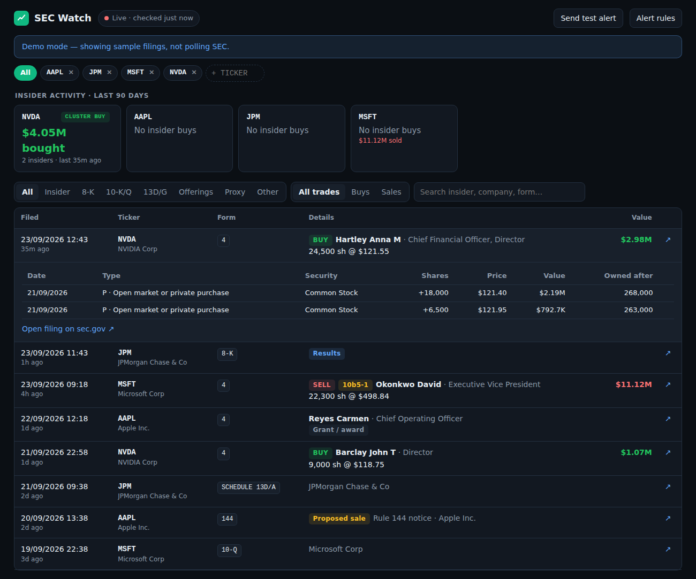
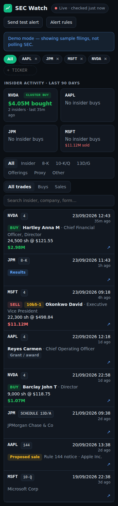

# SEC Watch

**Real-time SEC EDGAR filing alerts for the companies you actually care about.**

When a company insider buys their own stock on the open market, they have to tell the SEC on a
Form 4. SEC Watch notices within about a minute and pushes it to your phone — separating the
signal (someone spent their own money) from the noise (share grants, tax withholding, and sales
scheduled months in advance).

[](https://github.com/Cyrimbers/sec-watch/actions/workflows/ci.yml)
[](LICENSE)
[](https://www.python.org/)



<details>
<summary>On a phone</summary>



</details>

---

## What it does

| | |
|---|---|
| **Watches EDGAR live** | Polls the "latest filings" feed every 20s, plus a per-company sweep every 5 minutes as a safety net |
| **Reads the filings properly** | Parses the raw Form 3/4/5 XML — not scraped HTML — so shares, prices and transaction codes come from the filing's own fields |
| **Knows a real buy from a grant** | Only transaction code **P** counts as a purchase. Grants (A), option exercises (M) and tax withholding (F) are labelled, not alerted |
| **Flags 10b5-1 plan sales** | Sales under a pre-arranged trading plan are detected from the form's checkbox and footnotes, and can be muted |
| **Catch-up digest** | Been offline? One summary notification of what you missed, not a flood |
| **Filterable dashboard** | By ticker, form type, and buys vs sales, with every transaction line and the filing's own footnotes |
| **Cluster buys** | Highlights when two or more insiders at the same company buy within 30 days |

Alerts go to [ntfy](https://ntfy.sh) — free, no account, no bot tokens.

```
🟢 NVDA: insider BUY $2.98M
Hartley Anna M (Chief Financial Officer, Director) bought 24,500 sh @ $121.55
Form 4 · code P (open market or private purchase)
```

## Try it without an SEC connection

```bash
pip install -r requirements.txt
python tools/demo_seed.py
SECWATCH_DEMO=1 uvicorn app.main:app --port 8080
```

Open <http://localhost:8080>. Demo mode seeds realistic sample filings — parsed through the same
code path as live data — and never contacts SEC.

## Running it for real

**Requires:** Docker.

1. Copy `.env.example` to `.env` and fill in both values:

   ```ini
   SEC_USER_AGENT=Your Name your.email@example.com   # SEC blocks anonymous requests
   NTFY_TOPIC=secwatch-something-random-and-private
   ```

2. Install **ntfy** on your phone and subscribe to that topic. Anyone who knows the topic name can
   read it, so make it hard to guess.

3. Start it:

   ```bash
   docker compose up -d --build
   ```

4. Open <http://localhost:8080> and hit **Send test alert**.

Edit `config.yaml` for the starting watchlist and poll intervals; after first run, the watchlist
and alert rules live in the database and are editable from the dashboard.

### Alert rules

| Rule | Default |
|---|---|
| Insider open-market buy | On, any size, urgent priority |
| Insider open-market sale | On, $1M minimum |
| Skip 10b5-1 plan sales | On |
| Other forms | 8-K, SC 13D / SCHEDULE 13D |
| Ignore filings older than | 90 minutes (anything older goes in the catch-up digest instead) |

## How it works

```
EDGAR live feed (Atom)  ─┐
                         ├─► matcher ─► SQLite ─► parser ─► rules ─► ntfy ─► phone
submissions JSON (sweep) ─┘              │         (Form 4 XML)        │
                                         └──────────► FastAPI ─────────┴─► dashboard
```

| File | Responsibility |
|---|---|
| `app/edgar.py` | Rate-limited SEC client (6 req/s), feed and submissions parsing |
| `app/form4.py` | Ownership-document XML → transactions, with buy/sell classification |
| `app/alerts.py` | Rule evaluation, message building, ntfy delivery |
| `app/poller.py` | Background loops: live poll, sweep, backfill, catch-up digest |
| `app/main.py` | JSON API and dashboard |
| `app/db.py` | SQLite storage and migrations |

### Three EDGAR details worth knowing

These caused real bugs during development, and they're the sort of thing that isn't in the docs:

1. **`acceptanceDateTime` really is UTC**, despite widespread claims that the trailing `Z` is
   Eastern. Verified against a filing's "Accepted" field on its index page, which SEC prints in
   Eastern: JSON `2026-09-22T00:41:22Z` == index page `2026-09-21 20:41:22` EDT. Treating it as
   Eastern stamps every filing 4–5 hours into the future and silently widens the alert window.
2. **Code P is "open market _or private_ purchase."** A negotiated placement and an exchange
   purchase share one code, so a price far from the market isn't necessarily an error — the
   filing's footnotes say which it was, which is why they're stored and displayed.
3. **An option exercise legitimately appears twice** in one Form 4 — once in Table I and once in
   Table II. Deduplicating those would be wrong.

## Development

```bash
pip install -r requirements-dev.txt
pytest -q          # 19 tests, no network required
ruff check .
```

Tests run against fixture filings in SEC's real schema, and the end-to-end test drives the whole
pipeline — feed to alert — through a fake SEC client.

## Security

Filings are untrusted XML from the public internet, so parsing goes through
[`defusedxml`](https://pypi.org/project/defusedxml/) to block entity-expansion attacks.
Secrets live in `.env`, which is git-ignored. See [SECURITY.md](SECURITY.md).

## Limitations

- **Only runs while your machine does.** Alerts stop when the computer sleeps; the catch-up digest
  covers the gap when it wakes. A £4/month VPS removes the problem.
- **US SEC filers only.** LSE tickers like `VUAG.L` won't resolve.
- **Fast on the filing, not the trade.** Insiders have two business days after a trade to file, so
  you see the filing the moment it's public — not the trade the moment it happens.
- EDGAR accepts filings 06:00–22:00 US Eastern. Nothing arrives outside that window.

## Disclaimer

For information only. **Not financial advice.** Data comes from SEC EDGAR and is presented as
filed; filings can be amended or contain errors, and this software may contain bugs. Verify
anything you intend to act on against the original filing, which every row links to. No warranty —
see [LICENSE](LICENSE).

## Licence

MIT — see [LICENSE](LICENSE).
